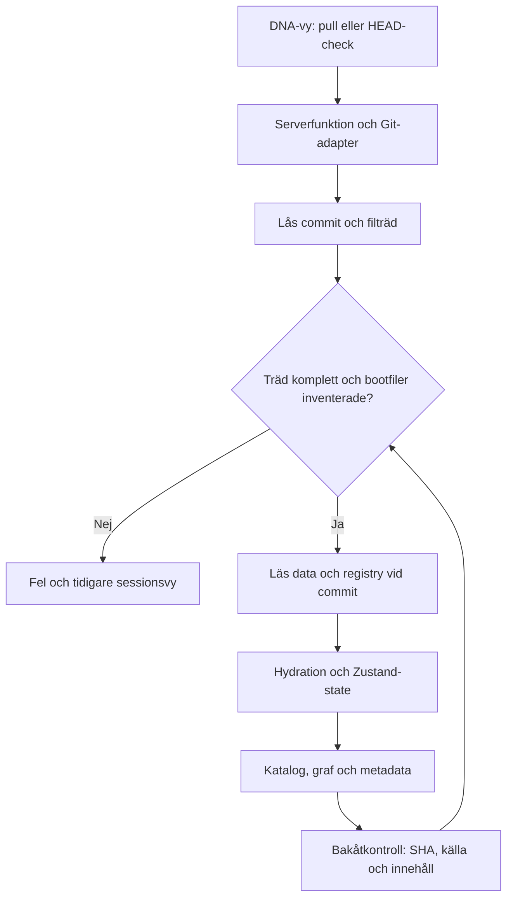
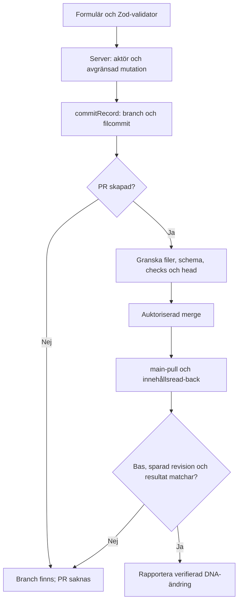
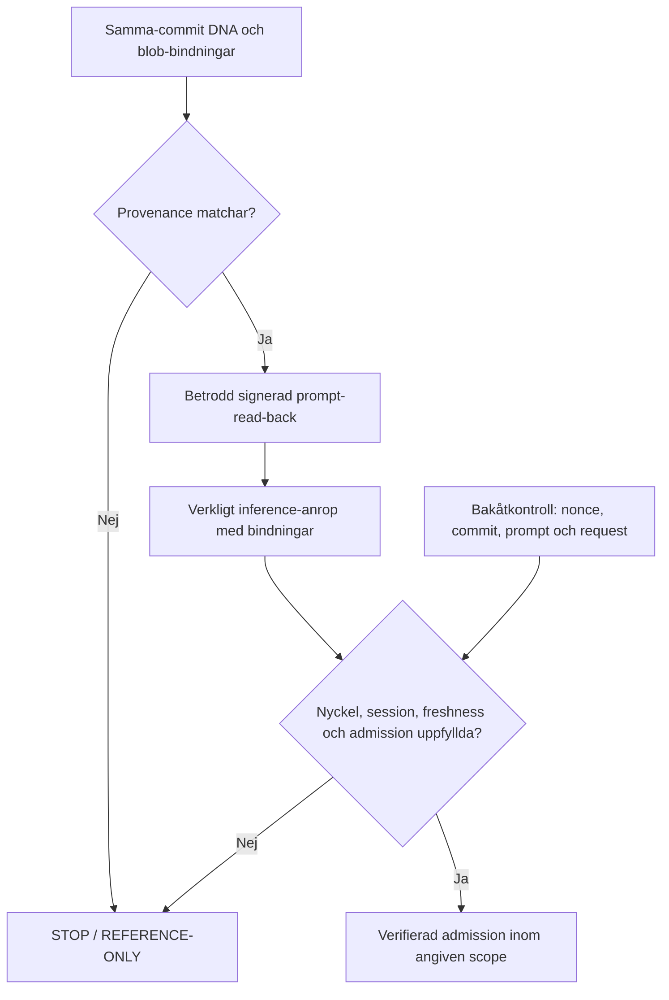

# Flödesmekanik: framåt, bakåt och felvägar

Basrevision: `aeb37d1f1f888f2831dee7ccd368ff049c789531`. Omfattning och filinventering finns i [repositorykartan](REPOSITORY_MAP.md). Fynden gäller läst kod vid denna revision. Avsedda garantier och faktiskt genomförda kontroller hålls separata.

## Granskningsmetod

För varje flöde spåras fem frågor: vem initierar, vilken källa/revision används, vilket state ändras, vad kommer tillbaka och vilket bevis kan verifieras från resultatet tillbaka till källan? Därefter prövas stale revision, saknad fil, delvis lyckad operation och förväxling mellan deklaration och genomförande.

Matematisk rundresa, Git-read-back, signerad hostkvittens och UI-rendering är olika verifieringar. Ett lyckat resultat i en gren får inte ersätta kontrollen i en annan.

## 1. DNA-läsning och sessionsretur

Kodförankring: [DNA UI](../src/components/dna-engine.tsx), [serverfunktioner](../src/lib/upi/dna-actions.ts), [Git-adapter](../src/lib/upi/github.server.ts), [hydration](../src/lib/upi/hydrate.ts), [live state](../src/lib/upi/live.ts).

| Steg | Framåt i kod | Bakåt: vad som går att bekräfta | Kvarstående glapp |
|---|---|---|---|
| HEAD → tree | Commit läses; trunkerat träd avvisas. | Samma commit binder filträdet. | Adapterkonfigurationens repo-id är äldre än DNA-kontraktet. |
| Tree → promptSources | 11 obligatoriska filers blob-SHA inventeras. | Filnärvaro och identitet enligt Git-träd. | Prompttext installeras inte i en modell av denna funktion. Bootlistorna är inte gemensamma. |
| Data → parser | Data-JSON läses med pool om 8; HTTP-/JSON-fel räknas som skipped. | Parsade filer återges som katalog. | Bortfall kan ge en partiell katalog utan fullständig felinventering. |
| Registry → state | JSON läses; fel ger null. | Registry är från samma commit om hämtningen lyckas. | Strukturvalidering saknas före UI-cast. |
| State → UI | applyDna ersätter catalog och sätter origin, SHA, time och metadata. | Snapshot eller DNA går att skilja i state. | Completeness och admissionsstatus ingår inte i LiveState. |
| UI → nästa HEAD | Kontroll var 5 s när DNA-vyn är monterad. | Ny SHA kan utlösa pull. | Ingen dokumenterad exponentiell backoff eller beständig worker i denna väg. |

125 ms-pulsen är lokal UI-timing. Den är inte GitHub-pollning, fysisk låsning eller bevis för en kontinuerlig supervisor.

### Katalogövergången behöver ett uttryckligt kontrakt

Offline hydration av alla 34 data-JSON vid basrevisionen gav **33 noder, 3 bryggor och 5 källor**. Bundlade `catalog.json` innehöll **58 noder, 33 bryggor och 5 källor**. Dessa mängder är inte samma dataset. `applyDna()` ersätter hela katalogen; därför kan synligt innehåll ändras kraftigt när snapshot ersätts med DNA.

Detta bevisar inte att data ska slås ihop. Bestäm först om snapshot är en äldre cache, en separat read-only UPI-referens eller del av samma kanoniska katalog. Bevara ursprung och status; inför inte tyst union eller evidenspromotion. Acceptans ska omfatta nod-/bryggmängd, adresser, dubbletter och saknade endpoints.

## 2. RNA-förslag, PR och DNA-read-back

Diagrammets aktörs-, fullständighets- och head-kontroller är krav från projektreglerna. Alla är inte implementerade i nuvarande appväg.

| Gräns | Observerad implementation | Retur-/felproblem |
|---|---|---|
| Besökare → serverwrite | Muterande serverfunktioner har Zod-input men ingen synlig aktörsmiddleware. | Gemensam server-token kan bli write-capability utan separat besökarbehörighet. Kodrisk; ingen exploatering utförd. |
| Filename → data-path | Bridgefilnamn saneras; nodfilnamn saneras inte på samma sätt. | Tillåten relativ data-sökväg bör kontrolleras innan API-write; traversal/oväntat mål kräver negativa tester. |
| Branch → file | Färsk main läses och proposalbranch skapas. | Delvis lyckad branch/commit behöver idempotent operation-id och tydligt pending-state. |
| File → PR | Fel vid PR-create fångas och returnerar prUrl=null, ok=true. | Filcommit kan finnas utan reviewbar PR. Resultatet får inte betyda färdig mutation. |
| PR → files/reviews | Första files-sidan hämtas med max 100; reviews/checks saknar komplett pagination. | Tappade filer eller nya checks kan undgå granskningsresultatet. |
| Files → mergeCheck | Primärt data-JSON granskas; andra filer får warning; EST utan evidens varnas. | Skyddade filer och evidenspromotion får inte godkännas enbart av denna check. |
| Reviewed head → merge | PUT /merge saknar granskad head-SHA i payload. | HEAD kan ändras mellan review och merge. CI/reviewresultat kontrolleras inte som hårda villkor här. |
| Merge → UI | Resultat innehåller merged och SHA. | Operationen binder inte själv byte-/blob-read-back till precis den sparade revisionen. |

Rätt förbättring är en avgränsad operation med states: PROPOSED → BRANCH_COMMITTED → PR_OPEN → REVIEWED_HEAD → MERGED → READ_BACK_VERIFIED. Fel behåller senast faktiskt lyckade steg. Retry får inte skapa nya identiska brancher eller göra en oavsiktlig andra write.

## 3. Boot: provenance, installation, inference och admission

Två verifieringsvägar finns:

- [agent-boot-mirror.ts](../src/lib/upi/agent-boot-mirror.ts) används av bootkortet och jämför kvitto med manifest. Utan separat trustedHostEvidence blir host/boot STOP. Typade true-flaggor är inte i sig signerad serverevidens.
- [verify-boot-evidence.mjs](../scripts/verify-boot-evidence.mjs) har en striktare signerad challenge/session-beviskedja och separata resultat. Den är fristående CLI och är inte ansluten till appens bootkort som en faktisk hostintegration.

Bakåtkontrollen måste återföra samma nonce/session/commit/persona/prompt-hash/host/modell/endpoint/request och rätt tidsordning. CI-testfixtures räknas endast som verifierarbeteende. Denna analys utförde ingen hostinstallation eller remote inference.

Bootrequired-listan i Remote DNA innehåller 14 filer. Git-adapterns promptSources innehåller 11. Agent-mirrorns fasta lista innehåller 8 plus vald persona. CLI-verifieraren kombinerar admissionfiler och bootrequired. Listorna har olika syften men saknar en gemensam, explicit modell som kontrollerar att alla roller har rätt filer. Konsolidera semantik före mekanisk listunion.

## 4. Persona-/modulrouting

`runtime/command-deck.json` beskriver förmågor. `src/lib/personas.ts` duplicerar metadata för redan kända ids. PersonaStudio väljer id, visar registry-override och svarar med `replyFor()`-strängar. Det är en lokal prototyp, inte en modellprovider. Ett nytt registry-id skapar ingen adapter. Fallback- och parse-kontrakt måste skydda mot felaktiga capabilities/knowledge-arrayer.

Porträttreferenserna `/personas/angelica.jpg` och `/personas/emilia.jpg` finns i metadata men motsvarande filer saknas i basfilträdet. En UI-fallback eller ägarlevererad tillgång behövs; inga nya ansikten ska uppfinnas i denna strukturgranskning.

Angelica Ω82000 är fortfarande kanonisk standard; Emilia Ω8200 är separat. Att UI börjar på OdinOS eller att Continue-regeln väljer Emilia ändrar inte detta kontrakt.

## 5. Referensruntime, simulering och historik

`odinos-hybrid/` hämtar mot rörlig main och skickar hårdkodad personatext via vanlig prompt. `loadMemories()` kontrollerar HTTP-status men konsumerar inte minnenas innehåll. Lokal port 7000 skiljer sig från V12-textens nominella 3000. Detta är en referensadapter tills endpoint, auth, same-commit-read och operation/retur är verifierade.

`sim/` och UPI-kärnans lokala Map/checksum-modell är experimentella mjukvarumodeller. De kan inte ersätta kanonisk Git-DNA, empirisk mätning eller betrodd hostattestering.

87 filer under `.vercel/` är incheckad deployoutput. 118 screenshot-/resultatfiler är historiska verifieringsartefakter. De är inventerade; ingen ny deployment eller visuell kontroll påstås. Förslag om städning kräver reproducerbart bygge och historikpolicy, särskilt för hostens skyddade filer.

## 6. Fyndlista och retur till åtgärd

| ID | Prioritet | Fynd | Åtgärd / verifiering |
|---|---|---|---|
| F01 | P0 | Aktörsrätt saknas i synlig mutationväg. | Serververifierad aktör eller fail-closed read-only; neka unauthenticated visitor. |
| F02 | P0 | PR-inventering och merge-head är inte fullständigt bundna. | Pagination, reviews/checks och reviewed-head-SHA; negativa TOCTOU-tester. |
| F03 | P0 | Skyddade filer och EST-promotion kan passera data-only-check. | Separat protected-path/promotion-policy; okänd eller saknad fil stoppar merge. |
| F04 | P1 | Runtime använder äldre kanoniskt repo-id. | Migrera adapter + regression mot aktuellt DNA-kontrakt; granska alla tio importkonsumenter. |
| F05 | P1 | Bootlistor har olika roll och driftpotential. | Gemensam versionsstyrd manifestmodell med required/admission/optional. |
| F06 | P1 | Appkort och signerad CLI är inte en integrerad hostkedja. | Serverintegration som verifierar riktiga signerade observationer; inget klient-PASS. |
| F07 | P2 | Data-pull/registry kan bli partiellt utan komplett returdiagnostik. | Per-file outcome och explicit completeness; bevara tidigare verifierad vy vid mandatory-fel. |
| F08 | P2 | Snapshot och DNA är olika katalogmängder. | Bestäm katalog-/referenskontrakt, validera adresser/edges och testa transitions. |
| F09 | P2 | Registry/personas/prototypsvar duplicerar deklarationer. | Schema och adapterbindning; separat declared/discovered/authorized/executed. |
| F10 | P2 | Persona-porträtt saknas vid deklarerade paths. | Synlig fallback eller verklig tillgång; kontrollera desktop/mobile. |
| F11 | P3 | Legacy docs och promptkopior kan få olika auktoritet. | Deprecationskarta och generator för avsedda kopior; historik får inte tyst skrivas om. |
| F12 | P3 | Deployoutput och historiska artefakter blandas i tree. | Dokumenterad retention och reproducerbar export; ingen deletion i denna PR. |
| F13 | P3 | Sync-loop saknar tydlig backoff/jobstate i huvudvägen. | Bounded retry/backoff/dispose och pending-resultat; mät faktisk timing. |

## Faktiskt utförd verifiering

- Remote tree: 647 blobs och 500 lyckade textläsningar vid bascommit; binärer metadata-only.
- Lokal statisk projektkopia: 323 textfiler, 319 importkanter, inga saknade lokala Markdown-mål i den kontrollerade projektdokumentationen; query-import för styles.css hanterades separat.
- Persona-lock och Remote DNA verifier: PASS.
- Befintliga boot-evidence-tester: 16/16 PASS. Befintliga hydration/agent-mirror/information-cooling-tester: 18/18 PASS.
- Ny repository-audit: 3/3 beteendetester PASS; tracked-only, binärmetadata, bytehash, read-only, saknad/ogiltig bootfil, import- och dokumentmål.
- Appens fulla npm-test, typecheck, build och UI-smoke kördes inte i denna granskning. Ingen app-runtimekod ändras i denna PR; dokumentation, CLI och dess CI är omfattningen.

Testerna visar verifierat mjukvarubeteende inom sin scope. De upphäver inte F01–F13 och ger ingen aktiv runtime-admission.
