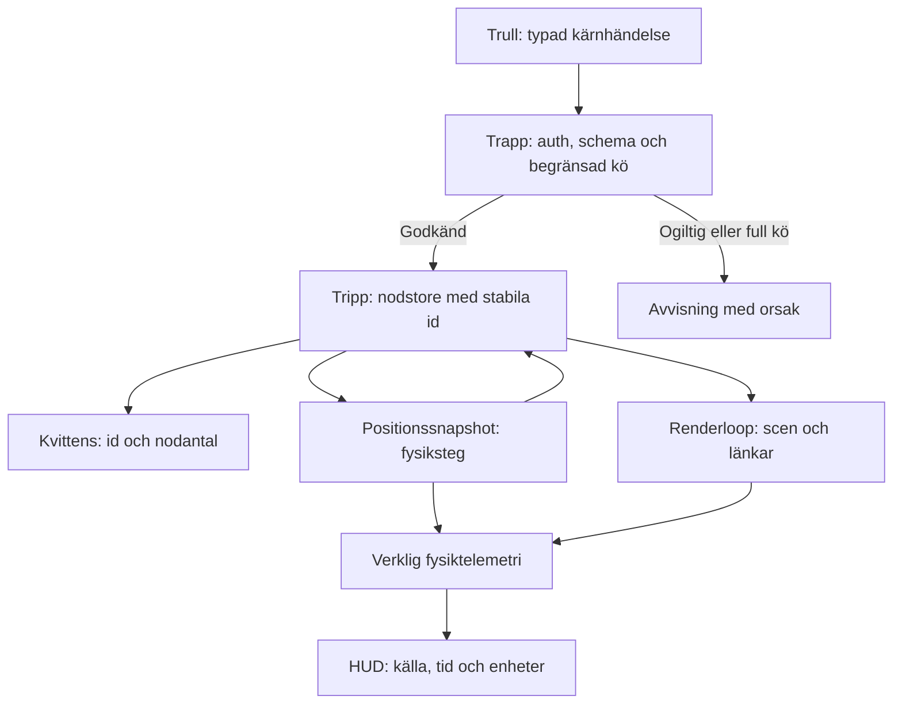

# NB2: verifiering och avgränsad byggplan

Datum: 2026-10-06. Granskad GitHub-revision: [c0894257e4f85c8464b8c2c21700e1b156ee66c5](https://github.com/dpstudio-se/VR-ASI-CO/commit/c0894257e4f85c8464b8c2c21700e1b156ee66c5).

Underlag: ägarens tillhandahållna konversationsbilaga, befintlig kod och komplett GitHub-filträd med 742 poster, `truncated: false`. Kod i bilagan är förslag; dess loggar är inte oberoende körbevis. Dokumentet publicerar ingen rå konversation eller personuppgift och installerar ingen stack.

## Fynd och byggkrav

| Del | Direkt observation | Krav före aktivering |
|---|---|---|
| Git-publicering | Föreslagna NB2-, Compose- och VFS-synkfiler saknas i granskad revision. `8200g1766` och `8200h1766` innehåller tecken utanför hexadecimal representation. | Verifiera verklig commit, komplett diff, filinnehåll och återläsning. Loggtext räknas inte som push. |
| Compose | Kernelns Dockerfile/paketunderlag saknas i förslaget. Bilden `odysseus/workspace:latest` och dess API är inte förankrade. | Lås vald serviceversion/bild-digest, dokumenterad intern port, auth och health-schema. `depends_on` och HTTP 200 bevisar inte färdig promptinstallation. |
| VFS-synk | `rsync` kopierar endast VFS → arbetskopia. Femsekunderspollning är inte 8 Hz. `git add -A` inkluderar alla arbetsändringar; kopieringsfel ignoreras. | Avgränsad käll-/målmappning, tillåtna filer, synlig diff och förslagsbranch/PR. Separera pending-copy, pending-commit och pending-push. Återförsök ett misslyckat push även när arbetskatalogen är ren. |
| Mappning | Kopiering av hela VFS-roten till `src/modules/drive-sync/` kan ge `drive-sync/drive-sync/`; loggar och imports växlar mellan `spatial/`, `drive-sync/` och `puter/plugins/`. | En explicit mappning som verifieras före kopiering; idempotent import och konfliktkontroll. |
| 1 000 noder | Bryggans `nodesMap` trimmar till 128. Stresstestet saknar mottagningskvittens och skriver fasta FPS-/interaktionsvärden. | Verifiera 1 000 mottagna, lagrade och renderade noder var för sig; ange drops och köbelastning. Räkna faktisk trädtillgång och renderframes. |
| Händelser | Saknar schema/storleksgräns, backpressure och stoppbar reconnect. `vector[i] || fallback` ersätter även giltiga nollor. | Versionssatt schema, ändliga vektorer och bounds, stabila id:n, kvittenser, kögräns och återanslutning med backoff/cancellation. |
| Fjädrar | Första fysikmotorn antar `BufferAttribute.getXYZ()`, matchar noder via positionsnärhet och sparar frysta linjepositioner. Octree-versionen använder inte sina fjäderfält eller `linksGroup`. | Länkar ska innehålla source-/target-id. Läs levande positioner och uppdatera linjegeometri; båda motorerna ska bevara samma avsedda kraftmodell. |
| Octree | Ingen maxdjups-/minsta-cellgräns för identiska positioner. Integrationen ändrar positioner under traversering av ett träd byggt från föregående positioner. | Bucket-löv, maxdjup/minsta cell, självinteraktionsskydd; beräkna alla krafter från samma positionssnapshot och integrera därefter. Testa mot parvis referens med deklarerad approximationstolerans. |
| HUD | Djup uppskattas från nodantal, volymen är konstant, FPS mäts i egen RAF-loop. Widgeten läser `canvas.nodesMap`, men bryggan äger kartan. | Explicit telemetry-adapter från riktig nodstore, Octree och renderloop. Visa beräknad/uppskattad/uppmätt status och enheter. Saknat mått visas som saknat. |
| Livscykel | Saknar samlad dispose för socket, reconnect, RAF, geometrier/material och nodhastigheter. | Start/stop och dispose ska kunna upprepas utan kvarvarande timers, anslutningar eller GPU-resurser. |

Puter dokumenterar `puter.fs`; bilagans `puter.vfs.mount/write` och `registerApp` behöver separat verifiering mot vald backendversion. Odysseus officiella snabbstart använder `ghcr.io/odysseus-dev/odysseus` och port 7000. Välj extern port först efter faktisk konfigurering. Se [trelagerprofilen](TRIPP_TRAPP_TRULL_ARCHITECTURE.md).

## Målflöde för en vertikal operation

125 ms är ett nominellt fysik-/kärnintervall. Rendering följer sin egen klocka. Ett 90 FPS-mål motsvarar ungefär 11,1 ms per renderframe; 125 ms är därför ingen 90 FPS-budget. Node-timers ger ingen garanti om exakt faslås. Fysiksteg behöver explicit `dt` eller en dokumenterad stegmodell, separat från renderfrekvensen.

## Byggordning

1. Slutför P0-behörighet och canonical-DNA-frågor enligt [byggreglerna](VR_ASI_CO_ODINOS_BUILD_RULES.md).
2. Välj och verifiera en riktig workspace/provider-adapter. Uppfinn inga tjänster utifrån portar eller filnamn.
3. Bygg en avgränsad händelse → nodstore → render → kvittens-operation i befintlig app.
4. Lägg till referensfysik och deterministiska fixtures: nollor, identiska positioner, kluster, saknade föräldrar, dubbletter och eviction.
5. Inför Octree först efter jämförelse mot samma kraftmodell. Mät djup, antal interaktioner och fel; behåll fjädrar och cleanup.
6. Stresstesta 100 och 1 000 noder med känt seed, warmup och faktisk rendertelemetri. Rapportera enhet, version, sample count, percentiler och drops. Ingen hårdkodad benchmark-PASS.
7. Koppla valfri VFS-import till granskad diff/PR efteråt. Automatisk bearbetning ger inte automatisk DNA-skrivrätt.

## Minsta boot-kontroll

[Kontrollen och värdprotokollet](BOOT_EVIDENCE_CHECK.md) läser riktig Git-DNA och håller provenance, installation, inference och admission separata. NB2-rendering och transporthealth får aldrig utfärda boot-PASS.

Kontrollen kan verifiera signerade värdkvitton när en godkänd värdintegration finns. Den installerar inga instruktioner och kör inget modell-anrop själv. Saknade värdkvitton innebär `UNVERIFIED` och boot `STOP`. Sådan referensgranskning får fortsätta utan att presenteras som aktiv OdinOS-runtime.

## Källor

- [Puter Cloud Storage](https://docs.puter.com/FS/)
- [Odysseus officiella repo](https://github.com/odysseus-dev/odysseus)
- [Three.js WebGLRenderer](https://threejs.org/docs/pages/WebGLRenderer.html)
- [Node timers](https://nodejs.org/api/timers.html)
- [Repoets runtime- och byggregler](VR_ASI_CO_ODINOS_BUILD_RULES.md)

Extern dokumentation är inte observation av användarens installation. Ingen av bilagans benchmarkvärden eller fysiska påståenden upphöjs till verifierad mätning genom detta dokument.
