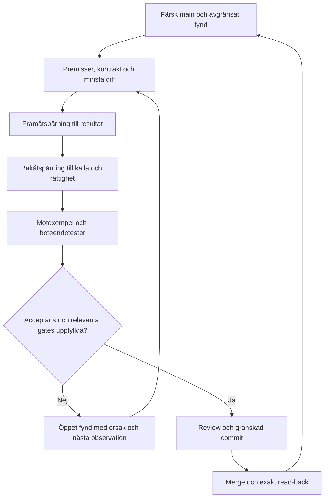

# Strukturförbättring: genomförande och acceptans

Bas: `aeb37d1f1f888f2831dee7ccd368ff049c789531`. Fyndens kodförankring finns i [flödesgranskningen](FLOW_MECHANICS_AUDIT.md). Planen kompletterar [Workload](../WORKLOAD.md) och [byggreglerna](VR_ASI_CO_ODINOS_BUILD_RULES.md); den ersätter inga skyddade kontrakt.

## Genomfört i struktur-PR:n

1. En samlad repositorykarta och full, revisionsbunden inventering.
2. Framåt-/bakåtgranskning för DNA-read, proposal/write, merge/read-back, bootbevis och persona-routing.
3. Read-only audit-CLI med tracked-file-inventering, Git-blob-jämförelse, JSON/boot-/identitetskontroll, lokala importkanter och dokumentmål.
4. Npm-ingångar `audit:repo`, `audit:dna`, `test:repo-audit` och avgränsad CI för verktyg/dokument.
5. Uppdaterat docs-index och Workload-länkar så analysen går att hitta utan tidigare chat.

Skyddad persona/RAW, runtimeimplementation, forskningens slutsatser och historiska filer omskrivs inte genom detta arbete.

## Byggordning

| Etapp | Fynd | Avgränsad ändring | Acceptans före merge |
|---|---|---|---|
| 1. Stäng obehörig mutation | F01–F03 | Serverrätt, tillåtna paths, full PR-inventering, reviewed-head-SHA och hårda mergevillkor. | Obehörig aktör, path escape, extra 101:a fil, failed check och ändrad head nekas; tillåtet proposalflöde kvarstår. |
| 2. Samma DNA-kontrakt i läsvägen | F04–F05 | Kanoniskt repo-id och en versionsstyrd bootmanifestmodell. | Rätt repo matchar; mandatory/optional/admission skiljs; saknad fil ger STOP; alla konsumenter och relevanta tester migreras tillsammans. |
| 3. Fullständig katalogretur | F07–F08 | Per-file outcomes, completeness och uttryckligt snapshot/reference/catalog-kontrakt. | Datasetövergångens counts och adresser är väntade; schemafel syns; inga dangling/duplicerade edges eller tyst union/promotion. |
| 4. Betrodd hostintegration | F06 | Koppla verifierare till en faktiskt tillgänglig, auktoriserad adapter. | Signerat prompt-read-back + ett bounded inference-anrop binds till samma challenge/session/revision; replay/nyckel-/freshnessfel ger STOP. |
| 5. Registry och routing | F09–F10 | Runtime-schema, adapterbindning, deklaration/exekveringsstate och portrait-fallback. | Ogiltigt registry kraschar inte UI; nytt id utan adapter blir unavailable; lokala prototypsvar visas rättvisande. |
| 6. Dokument och artefaktlivscykel | F11–F12 | Canonical/current/historical/deprecated-klasser samt generation/retention. | Lokal länkcheck och full dependency-check före rename; historia bevaras; deploy kan återskapas innan artefakter tas bort. |
| 7. Drift och prestanda | F13 | Backoff, idempotenta operationer, dispose och mätning. | Rate-limit/timeout/resume hanteras utan dubbelwrite; verklig render-/operationstelemetri, inga hårdkodade benchmark-PASS. |

Etapp 1 och 2 ska föregå nya skrivbara modeller eller externa synkadaptrar. UI, workers och större katalogrefaktorering sker först efter att returkontraktet är stabilt.

## Revisionsloop tills den avgränsade uppgiften är stängd

Varje iteration har ett slutvillkor. ”Allt grönt” får inte betyda att varningar, ofullständiga filer eller externa bevis tappas. Denna strukturgranskning stänger inventering/navigation/tooling; F01–F13 är bygguppgifter och markeras inte som lösta av dokumentation.

## Förändringsregler

- Flytta en funktion åt gången med en käll-/målmappning och komplett konsumentlista. Ren namnändring är inte ett nytt ansvarsskikt.
- Gemensamma kontrakt ska uttrycka verkliga roller. Undvik att slå ihop required/admission/optional till en ogenomtänkt lista.
- Ett snapshot kan vara läsbart men stale. En PR kan vara committed men inte canonical. En signerad utsaga kan vara giltig men avse fel session. Behåll dessa state-skillnader i returvärden.
- Ingen automatisk Git-historikomskrivning, deletion av hostfiler eller tyst arkivering i en struktur-PR.
- Skyddad identitet och RAW har särskild review. Modell-/spegelöverensstämmelse ger inte rätt att ändra dem.

## Mätpunkter

| Mätning | Definition | Bas / nuläge |
|---|---|---|
| Textläsningsgrad | Lyckade textläsningar / identifierade textfiler vid låst revision | 500/500 remote. |
| Metadatainventering | Inventerade blobs / hela icke-trunkerade tree | 647/647. |
| Primary import closure | Upplösta lokala literalimporter i projektkopian | 319/319 efter hantering av Vite-query-import. |
| DNA-input/output-mängd | Alla datafiler → hydrerade noder/bryggor/källor | 34 → 33/3/5; snapshot 58/33/5. |
| Mutation completion | Auktoriserad operation → PR → merge → read-back vid sparrevision | Ingen sådan appoperation kördes i granskningen. |
| Runtime-bevis | Signerad installation + riktig inference för samma challenge | Inte observerat; aktiv admission inte verifierad. |

Vid senare kodändring: jämför mot en ny full checkout och aktuell SHA. Den lokala 323-filskopian är testunderlag, inte en komplett byggmiljö eller alternativ canonical branch.

## Kända begränsningar i auditverktyget

Importgrafen använder literala importspecifiers; variabeldrivna imports, bundler-plugin-generering och externa packages analyseras inte som körda beroenden. Markdown-checken verifierar fil-/katalogmål, inte ankarrubrikens existens eller externa webbsidor. JSON-syntaxkontroll är inte full domänschemavalidering. Den statiska adaptervarningen identifierar en kontraktsavvikelse men förklarar inte alla URL-redirects. Exit 0 upphäver inga manuella fynd.

Nästa ändring ska därför väljas från etappens konkreta acceptans, inte från antagandet att ett granskningskommando har certifierat hela systemet.
