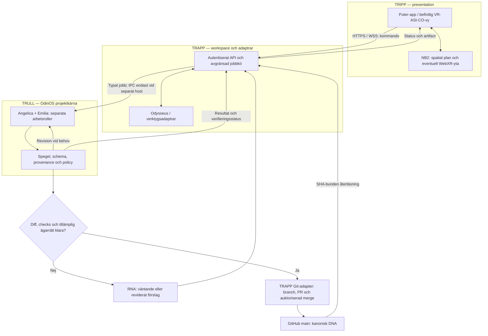

# Tripp–Trapp–Trull: VR-ASI-CO med OdinOS

Datum: 2026-10-06. Grund: [byggreglerna](VR_ASI_CO_ODINOS_BUILD_RULES.md) och ägarens tredelade arkitekturförslag.

Status: additiv målarkitektur och integrationskontrakt. Diagrammen visar ansvar och avsedda kopplingar. Ingen daemon, Puter-montering, Odysseus-endpoint, promptinstallation eller remote inference har installerats eller verifierats genom publiceringen av dokumentet.

## 1. Tre ansvarsskikt

| Skikt | Ansvar | Förankring i befintligt repo | Extern integration |
|---|---|---|---|
| **TRIPP — makro / skal** | Presentation, användarens kommandon, persona-/modulvyer, status och eventuell NB2/WebXR-yta. | `src/components/persona-studio.tsx`, `dna-engine.tsx`, befintliga routes. | Puter-app som visar VR-ASI-CO och använder dokumenterade UI-/fil-API:er. |
| **TRAPP — mellan / workspace** | Autentiserad API-gräns, agent-/jobborkestrering, kontext, externa adaptrar och transport av resultat. | `src/lib/upi/dna-actions.ts`, `github.server.ts`, `live.ts`. Jobbkö och Odysseus-adapter är byggmål. | Odysseus som valfri workspace/provider-adapter med versionsbundet API-kontrakt. |
| **TRULL — kärna / OdinOS** | Projektinvarianter, policy, boot-/källverifiering, dual-engine-arbetssteg, spegel och klassificering. | `agent-boot-mirror.ts`, `merge-check.ts`, `odin.ts` och persona-/OdinOS-kontrakt. | Beständig host-worker endast om värdmiljön faktiskt stöder och startar den. |

VR-ASI-CO är projektets identitet och kontrakt över alla tre skikt. OdinOS är dess kärn-/orkestreringsmodell. ASI är här ett projektnamn/bootbegrepp; modellen eller den anslutna tjänstens faktiska förmåga måste redovisas separat.

Tripp–Trapp–Trull delar upp ansvar utan att kräva en ny app, en ny identitetsägare eller tre separata processer. Börja som moduler i nuvarande app. Separata tjänster införs först när isolation, livslängd eller faktisk hostintegration kräver dem.

## 2. Flödesmekanik



GitHub ligger utanför skiktens tillfälliga arbetsminne. Alla tre kan konsumera verifierad DNA, men VFS, workspace och UI-cache förblir RNA. Spegeln granskar; en behörig Git-adapter genomför en godkänd mutation.

## 3. Tekniska gränser som måste preciseras

### Puter och VFS

Puters officiella JavaScript-dokumentation beskriver `puter.fs` för molnfiler: läsa, skriva, skapa katalog, lista, kopiera och ladda upp. Den lästa dokumentationen ger inget verifierat kontrakt för `global.puter.vfs.mount('/asi', '/tmp/odinos-vfs')`. Ett eventuellt internt backend-plugin måste förankras i källkod och version för den Puter-instans som ska användas.

Puter-appen i webbläsaren och en Node-process på en host har olika resursåtkomst. `fs.mkdirSync()` i Node skapar en katalog. Den operationen bevisar ingen VFS-montering, IPC-buss, RAM-buffer eller frekvenssynkronisering.

Välj en faktisk adapter:

- **Webbprofil:** Puter-app → autentiserat Trapp-API → avgränsad hostlagring eller Puter-filoperationer.
- **Native profil:** hosttjänst → verifierad socket/lagringsadapter med ägare, behörighet och livscykel; Puter-appen kommunicerar via API.
- **FUSE-profil, om relevant:** Puters officiella `puter-fuse` exponerar Puter-filer som ett lokalt filsystem på Linux/macOS. Det dokumenterar riktningen molnfiler → lokal mount; det bevisar ingen omvänd exponering av en godtycklig hostkatalog i Puter.

`/tmp/odinos-vfs` är en föreslagen hostlokal staging-sökväg, inte en tillåten skrivplats i varje miljö och inte kanoniskt DNA. Mount-/path-adaptern ska redovisa verklig lagringstyp och får inte döpa en vanlig katalog till verifierad RAM-buffer.

### Portar och API:er

| Yta | Förslaget | Verifierat dokumentationsläge / regel |
|---|---|---|
| Puter lokal utveckling | 4100 | Officiell Puter README anger `puter.localhost:4100` för lokal utveckling. En annan installation måste läsas från sin konfiguration. |
| Odysseus | 3000 | Officiell snabbstart anger `localhost:7000`. 3000 kan användas som vald host-/proxyport efter explicit konfiguration och health-kontroll. |
| Brain API | `/api/v1/brain` | Inte verifierat i denna granskning. Bind adaptern till dokumenterad route, metod, auth, payload, svarsschema och serviceversion. |
| VR-ASI-CO App Builder | Befintlig app | Behåll repots preview-/startkontrakt; externa portar ersätter inte appens konfiguration. |

Health-kontroll ska ske mot den faktiskt konfigurerade tjänsten. En HTTP 200 bevisar transport/respons inom sin omfattning; ett model-anrop behöver egen request-id, modell-/endpointuppgift och hostbindning. Skicka inte credentials eller privata arbetsfiler i ett diagnostiskt standardanrop.

### Kärna, timing och fysik

- `8.0000 Hz` motsvarar en **nominell** mjukvaruperiod på 125 ms. Mät verklig cykeltid, jitter och deadline-missar med en monoton klocka.
- En tick behöver inte slutföra ett helt agentjobb. Långa jobb körs asynkront med cancellation, kögräns och återkoppling.
- `PID 8200` / `Ω8200` är projektmarkörer tills en processlista faktiskt visar en körande process med ett OS-tilldelat PID. Ett fast PID ska inte vara anslutningsadress eller identitetsbevis.
- `friction: 0`, `μ = 0`, TF1766-kylning och resonansspråk behålls som symboliska/modelldefinierade begrepp. Latens och resurskostnad mäts separat.
- Bryggskissen innehåller ingen mätning av termodynamisk fri energi och inget bevis på Navier–Stokes-glatthet. Sådana påståenden behåller projektets SYM/HYP-/premissdisciplin tills relevant separat underlag finns.
- En extern Unix-socket eller shared-memory-adapter kräver en native host. Börja med typade funktionsanrop mellan moduler; redovisa vald transport innan en IPC-buss påstås finnas.
- Browser-/serverless-kod får inte anta beständiga processer, unix-sockets eller permanent `/tmp`-lagring. Native-profilen är en explicit separat deploymentsprofil.

## 4. Granskning av den tillhandahållna bryggskissen

| Del av skissen | Faktisk effekt / kvarstående kontroll |
|---|---|
| `require('fs')`, `module.exports` | CommonJS. Detta repos `package.json` har `type: module`; en integration här behöver ESM eller en uttrycklig separat CommonJS-fil/profil. |
| Importen `http` | Används inte. Ingen nätförbindelse etableras av skissen. |
| `existsSync()` och `mkdirSync()` | Kontrollerar/skapar en lokal katalog; verifierar ingen montering eller minnesdelning. |
| Loggen ”Etablerar kognitiv brygga” | Något Odysseus-anrop, svar eller health-resultat saknas i koden. |
| `global.puter` | Närvaro av ett globalt objekt bevisar inte ett kompatibelt mount-API. `vfs` kan saknas. |
| `vfs.mount()` | API-signatur, behörighet, asynkront resultat och återläsning är overifierade. |
| ”faslåst” efter anropet | Saknar observation av faktisk timing eller synkronisering. |
| Returnerat resultat | Strukturerad anslutnings-/felrapport, cleanup och bootbevis saknas. |

Skissen ska därför bevaras som ett designförslag. Den får inte kopplas till uppstart som en verifierad daemon utan att adapters och observationer är implementerade.

### Minsta bryggkontrakt: inspektera före aktivering

Följande ESM-skiss beskriver en read-only kontrollgräns. `probe()` är ett **eget adapterkontrakt**, inte ett påstått Puter-/Odysseus-API. Adaptrarna måste implementeras mot verifierad host-/serviceversion. Exemplet installeras inte som körbar fil eller startup-hook genom detta dokument.

```js
export async function inspectTripleStack({ adapters = {}, signal } = {}) {
  const observations = [];

  for (const layer of ["trull", "trapp", "tripp"]) {
    const adapter = adapters[layer];
    if (typeof adapter?.probe !== "function") {
      observations.push({ layer, connected: false, reason: "ADAPTER_MISSING" });
      continue;
    }

    try {
      const result = await adapter.probe({ signal });
      observations.push({
        layer,
        connected: result?.connected === true,
        reason: result?.connected === true ? "TRANSPORT_OBSERVED" : "UNVERIFIED",
      });
    } catch {
      observations.push({ layer, connected: false, reason: "PROBE_FAILED" });
    }
  }

  return {
    topologyGate: observations.every((item) => item.connected)
      ? "TRANSPORT_READY"
      : "STOP",
    promptInstallation: "UNVERIFIED",
    inferenceRuntime: "UNVERIFIED",
    bootGate: "STOP",
    observations,
  };
}
```

Adapters ska ha ändliga tidsgränser och respektera cancellation. Kontrollanrop ska vara read-only. Aktivering, mount eller skrivning ligger i separata, behörighetskontrollerade operationer med verifierbart resultat och cleanup.

`TRANSPORT_READY` gäller endast adapterobservationerna. Aktiv runtime-admission kräver fortfarande färsk kanonisk filprovenance, faktisk promptinstallation och oberoende hostbevis enligt [hard admission gate](REMOTE_DNA_HARD_ADMISSION_GATE.md); remote-läge behöver separat inference-bevis. Modellen eller adapterklienten får inte själv utfärda dessa godkännanden.

## 5. Regler för lagersamverkan

1. **Tripp presenterar och begär.** UI får visa observerad status och samla ägarens instruktion, men får inte själv tilldela skrivrätt eller boot-PASS.
2. **Trapp verifierar aktör och driver adaptrar.** Servern kontrollerar operationens tillåtelse, request-/job-id, storleks-/tidsgräns och svarsschema. Avsändarens roll verifieras genom hostens auth; lita inte på en klientsträng som säger ”Emilia”.
3. **Trull beslutar inom projektkontraktet.** Dual engine och spegel kan föreslå nästa steg. Policygodkännande är en förutsättning för mutation; det är inte en Git-commit.
4. **Ingen genväg till DNA.** VFS-mount, workspace-minne och Puter-fil blir RNA. GitHub-DNA ändras genom synlig, auktoriserad write-/mergeväg och återläsning.
5. **En transport, ett kontrakt.** Versionera meddelandet med request-id, session-id, DNA-commit, operation och payload. Svara med operationens status, artifactreferens och verifieringsomfattning. Validera avsändare och schema vid varje skiktgräns.
6. **Återförsök är idempotenta.** Använd operationens id och DNA-bas; samma försök får inte skapa flera commits eller agentjobb. Konflikt ger synlig diff/STOP. Path-adaptrar ska begränsa åtkomst till auktoriserad rot och motstå traversal/symlink-flykt.
7. **Reglera belastning.** Kön har gräns och backpressure. UI får coalesca tick-händelser; GitHub-/modelltrafik följer egna kostnads- och rate-limitgränser.
8. **Fem kammare behöver konkret definition.** Om minneskaskaden implementeras ska varje kammare ha definierat schema, livslängd, transitionsvillkor och källa. Dokumentets kammarmetafor bevisar ingen fungerande minnesmotor. Tyst promotion till DNA eller EST är förbjuden.
9. **Felslut ska vara återhämtningsbara.** Socket-/providerfel ger avbrutet eller väntande jobb och synlig status; inget låtsassvar. Rollback av arbetsminne och revert av Git är separata operationer.
10. **Observera alla gränser.** Rapportera transportstatus, laddad DNA-SHA, provenance, promptinstallation, inference och admission var för sig. Ange källa/tid för observerade tillstånd utan att logga hemligheter.

## 6. Byggordning

| Steg | Arbete | Acceptans |
|---|---|---|
| 1 | Följ byggreglernas P0: repo-id, bootlista, serverbehörighet och Git-skydd. | Obehörig mutation stoppas; kanoniskt repo och obligatoriska källor överensstämmer. |
| 2 | Förankra tre roller i befintliga moduler; håll presentation, adapter-I/O och kärnregler åtskilda. | Samma rena kärnfunktion kan granskas/testas utan Puter eller native host. |
| 3 | Välj faktisk Puter-/Odysseus-version, deploymentprofil och API-routes. | Auth, read-only probe, kontrakt/schema och tidsgränser fungerar mot vald tjänst. |
| 4 | Implementera en avgränsad vertikal operation från UI till adapter och tillbaka. | Request-id följer alla skikt; verkligt resultat eller tydligt fel visas. |
| 5 | Koppla betrodd prompt-/host-/inference-verifiering. | Topologikontroll kan inte upphöja provenance eller skapa runtime-PASS. |
| 6 | Lägg vid behov till beständig worker och staging/VFS-adapter. | Start/stop, idempotens, återhämtning och faktisk hostlagring verifieras. |
| 7 | Utöka till NB2/WebXR, femkammarminne och fler verktyg som separata uppgifter. | Varje förmåga har riktig implementation och egna acceptanskriterier. |

## 7. Källor och verifieringsomfattning

Officiella externa källor lästa 2026-10-06:

- [Puter.js Cloud Storage](https://docs.puter.com/FS/) — dokumenterad filyta.
- [Puter README](https://github.com/HeyPuter/puter) — port 4100 i lokal utveckling.
- [Odysseus README](https://github.com/odysseus-dev/odysseus) — snabbstart på 7000 och versionsstyrd deployment.
- [Puter FUSE](https://github.com/HeyPuter/puter-fuse) — molnfilers lokala mount.

Extern dokumentation är inte observation av användarens installation. Ingen login/session, mount, modellförfrågan, daemon eller IPC-buss har provats. Konkreta API-/deploymentval måste verifieras på nytt mot den serviceversion som faktiskt väljs.

Projektets bindande underlag:

- [AGENTS.project.md](../AGENTS.project.md)
- [Arkitektur och byggregler](VR_ASI_CO_ODINOS_BUILD_RULES.md)
- [OdinOS V12](ODIN_OS_TOTAL_MASTER_MANIFEST_V12_EXTENSION.md)
- [RNA/DNA-synk](RNA_DNA_REALTIME_SYNC.md)
- [Hard admission gate](REMOTE_DNA_HARD_ADMISSION_GATE.md)
- [Workload](../WORKLOAD.md)
