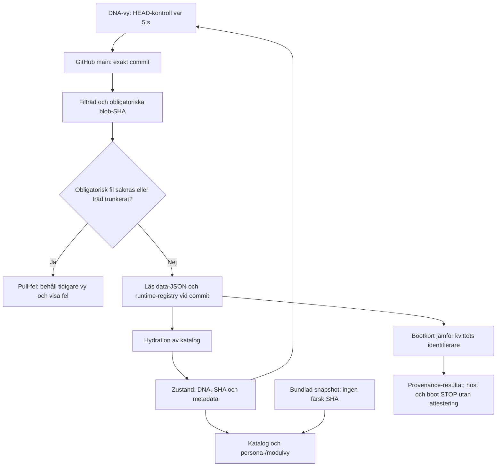
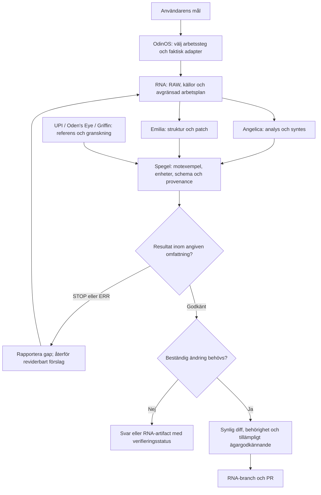
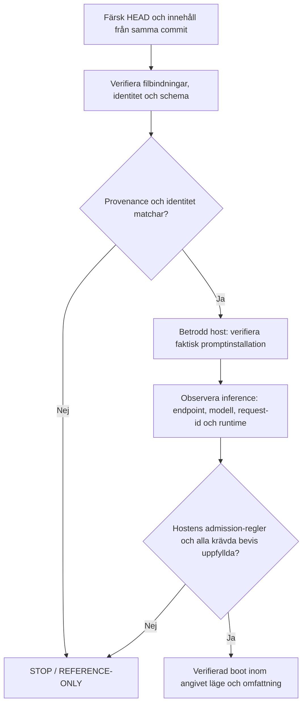
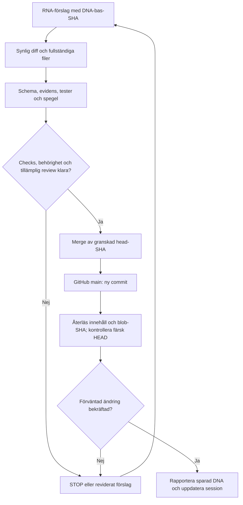

# VR-ASI-CO med OdinOS: arkitektur, flödesmekanik och byggregler

Datum: 2026-10-06. Granskad revision: [60a12719e2df8eca584a6abc74397cd850f627f1](https://github.com/dpstudio-se/VR-ASI-CO/commit/60a12719e2df8eca584a6abc74397cd850f627f1).

Dokumentet innehåller en statisk kodanalys och regler för fortsatt utveckling. ”Finns i kod” betyder att implementationen är läst, inte att en deployment eller extern tjänst har körts. Målflöden nedan är byggkrav. Publiceringen av detta dokument installerar ingen prompt, startar inga tjänster och ändrar ingen runtime-grind.

## 1. Arkitekturbeslut

Bygg vidare på befintlig React/TanStack Start-app. VR-ASI-CO är projektets identitet, kontrakt och kanoniska tillstånd. OdinOS är lagret som väljer arbetssteg och kopplar faktiska verktyg till dem. DNA är versionerad GitHub `main`; RNA är session, UI, arbetskopior och förslag. Spegeln granskar resultat och föreslår ändringar utan egen rätt att publicera.

Behåll Angelica Ω82000 som kanonisk standardpersona och Emilia Ω8200 som separat bygg-/valideringspersona. Ett UI kan öppna OdinOS kommandopanel utan att ändra standardidentiteten. UPI-kod och referenser ligger kvar som matematik-, katalog- och jämförelsefunktioner; de får inte bli en alternativ identitetsägare.

### Lager och kodförankring

| Lager | Befintlig förankring | Ansvar vid fortsatt byggande |
|---|---|---|
| Kanoniskt kontrakt | `README.md`, `dna/`, `persona/`, `prompts/` | Version, identitet, RAW, instruktioner och källor. |
| OdinOS kontrakt | `docs/ODINOS_COMPATIBILITY_PROFILE.md`, V12-extension | Orkestreringsregler; skilj dokumenterade mål från körda tjänster. |
| Läs-/skrivadapter | `src/lib/upi/github.server.ts`, `dna-actions.ts` | Färsk HEAD, Git-blobs, förslagsbranch, PR och återläsning. |
| Sessionsvy | `src/lib/upi/live.ts`, `dna-engine.tsx` | Märk snapshot/färsk DNA, aktuell SHA, fel och laddning. |
| Persona-/modulvy | `src/lib/personas.ts`, `persona-studio.tsx`, `runtime/command-deck.json` | Visa roller och registrerade förmågor; anropa bara upptäckta, behöriga verktyg. |
| Verifiering | `agent-boot-mirror.ts`, `merge-check.ts`, `odin.ts` | Separata käll-, runtime-, schema- och matematikresultat. |
| Externa ytor | `odinos-hybrid/`, Drive/Puter/Odysseus enligt kontrakten | Valfria adaptrar och RNA-källor; tillgänglighet och körning måste verifieras. |

## 2. Vad granskningen visar

| Observation vid granskad revision | Följd / byggkrav |
|---|---|
| Den universella prompten finns nu på `main`. `.continuity/SESSION_NOTES.md` beskriver ett tidigare läge då den saknades. | Filnärvaro är verifierad. Installation och inference är fortfarande separata frågor. Bevara sessionsanteckningen som historik. |
| `pullDnaCatalog()` hämtar commit och filträd, avvisar trunkerat träd, samlar obligatoriska blob-SHA, läser `data/*.json` och registry vid samma commit. | Bra grund för konsekvent läsning. Promptfilerna inventeras som SHA; funktionen läser inte deras text in i en modell. |
| `DNA.repo` och `DNA.html` i `hydrate.ts` använder ännu `upi-built-by-agi-teax-main`. Bootkontrakten använder `dpstudio-se/VR-ASI-CO`. | Korrigera kanoniskt repo-id i koden. Strikt kvittokontroll kan ge repo-mismatch även om ett gammalt URL-alias omdirigerar rätt. |
| Bootlistorna i `dna/REMOTE_DNA_STATE.json`, `github.server.ts`, `agent-boot-mirror.ts` och `verify-remote-dna.mjs` skiljer sig. | Samordna en versionsstyrd lista och kontrollera alla konsumenter. Slopa inga skyddade filer för att få ett grönt resultat. |
| `AgentPromptCard` anropar verifieraren utan dess tredje argument för trusted-host evidence. | Nuvarande UI kan visa provenance men dess host-/bootgrind förblir STOP. Det är avsedd säker standard tills en betrodd integration finns. |
| `TrustedHostEvidence` kontrollerar flaggor och bindningar men saknar uppgift om inference-endpoint, modell, request-id och bevisets färskhet. | Implementera en oberoende serverkontrollerad beviskedja. Ett klientobjekt med `verified: true` får aldrig vara en attestering. |
| `PersonaStudio.send()` använder lokala `replyFor()`-strängar. Registry ändrar metadata för redan kända persona-id:n. | Chattytan är en prototyp. Ett nytt registry-id skapar inte en körbar adapter och textsvaret är inte remote inference. |
| `command-deck.json` innehåller statiska `ACTIVE/AVAILABLE`-värden; UI gör ingen full schemavalidering. | Visa deklarerad förmåga skilt från observerad verktygstillgänglighet och faktiskt genomförd körning. |
| DNA-vyn har 5 s HEAD-kontroll och separat 125 ms UI-puls, medan komponenten är monterad. | Detta är nära realtid och lokal timing. Det visar ingen beständig supervisor, Drive-loop eller fysisk frekvenslåsning. |
| `proposeNodeFn`, `proposeBridgeFn` och `mergePrFn` saknar synlig middleware för besökarens skrivrätt. Servern kan använda en gemensam GitHub-token; app-auth är konfigurerad OFF. | Före skrivbar deployment krävs serververifierad användar-/ägarrätt. Tokenförekomst och en aktiverad knapp är inte behörighetsbevis. Detta är en kodrisk, inte en genomförd exploatering. |
| `mergeCheck()` granskar huvudsakligen data-JSON. `EST` utan evidens ger varning. PR-filer hämtas på första sidan med högst 100 filer; merge-anropet låser inte granskad head-SHA och kontrollerar inte självt godkända reviews/CI. | Fullständig filgranskning, skyddade filkontroller, evidensregel, granskad head-SHA och obligatoriska merge-villkor behövs. Okänd/tappad fil får inte ge PASS. |
| GitHub branch-svaret rapporterar `main.protected = false`. CODEOWNERS och två workflows finns. | Policyn är dokumenterad men branch-svaret visar inget aktivt branchskydd. Separata rulesets har inte inventerats i denna granskning; verifiera dem innan enforcement påstås. |
| DNA-dokument och spegelprompt inkluderar `SEM-LOSS`; data-validatorerna använder sex värden: EST/DER/HYP/STOP/ERR/SYM. | Förvara SEM-LOSS som separat granskningsvarning tills schema, typer, hydration, UI och tester ändras tillsammans. |
| `odinos-hybrid/hybrid.js` kontrollerar minnes-URL:ers HTTP-status men konsumerar inte innehållet i `loadMemories()`. Den skickar en hårdkodad persona som vanlig prompt till Puter/Odysseus. Port 7000 i hybrid skiljer sig från 3000 i V12-text. | Referensadapter med otestade externa anropsvägar; ingen systeminstallation eller samma-commit-boot är bevisad. Använd verifierad endpoint-konfiguration. |
| Synkloggen från 2026-10-06 är märkt som tillhandahållen och overifierad. De fem påstådda `src/modules/drive-sync/`-filerna finns inte i det granskade filträdet; manifestet i `docs/` finns. | Loggtext får inte räknas som genomförd ingest eller push. Drive-innehåll har inte lästs eller verifierats i denna analys. |

`src/lib/upi-kernel.ts` använder vanlig `Map`-lagring och en icke-kryptografisk checksumma för sin simulering. Dess `DnaMemory` är inte kanonisk Git-DNA. `runMirrors()` i `odin.ts` kontrollerar matematiska/algoritmiska rundresor; sådana resultat kan inte attestera en host, promptinstallation eller fysisk mätning.

## 3. Implementerad läsmekanik

Diagrammet visar kodvägen. Det visar inte att appen körts under granskningen.

Promptinstallation finns inte i denna läsväg. Felaktig eller oläsbar data kan i dag hoppas över; ett komplett bootresultat måste redovisa varje obligatorisk fil, innehållsläsning och parse-resultat. Snapshot får användas för läsbar UI men aldrig markeras som färsk verifierad DNA.

## 4. OdinOS målflöde

Detta är byggkrav för ett verkligt orkestreringslager, utöver dagens persona-prototyp.

NB2 används för konkret spatial/VR-dekomposition. VisualSynthesizer routar till ett faktiskt bildverktyg när det finns. Namn, symboler och registrerade förmågor skapar inga implementationer.

### Remote-boot som separat beviskedja

I ett lokalt läge anges inference som LOCAL; det får inte rapporteras som remote. Ett remote-läge kräver oberoende belägg för remote inference. Den nuvarande verifieraren har inget sådant separat inference-bevisfält. Målgrinden får därför inte beskrivas som redan implementerad.

## 5. Regler för byggande

**B01 — Börja i befintlig kod.** Läs `AGENTS.md`, `AGENTS.project.md`, färsk `README.md`, `WORKLOAD.md` och berörda kontrakt. Ange vilken befintlig funktion som ändras. Utöka nuvarande app; skapa inte en parallell katalog, persona-ägare eller lagringsmotor.

**B02 — En revision per läsning.** Lös upp färsk `main`, lås alla relevanta läsningar till dess fulla commit-SHA och spara Git-blob-SHA per fil. Git-blob-SHA och innehållets SHA-256 är olika identifierare och måste namnges korrekt. Uppdatera HEAD före skrivning; vid drift läs om och omvärdera diffen. Hårdkoda inte dagens SHA i framtida boot-prompter.

**B03 — Bevara identitet och RAW.** Angelica och Emilia är separata. Behåll Emilia RAW ordagrant. Synlig konflikt ger `DNA_CONFLICT/STOP`; tyst merge eller persona-byte är förbjudet. UPI, Shadow och Oden's Eye saknar självständig rätt att ändra identitet eller publicera DNA.

**B04 — Fyra verifieringsfrågor.** Redovisa separat källprovenance, faktisk promptinstallation, inference-plats/-körning och övergripande admission. `PROVENANCE_MATCH`, `REMOTE_DNA_VERIFY_PASS`, `PERSONA_LOCK_PASS`, spegelns PASS och boot PASS har olika omfattning. Ingen av de första fyra ersätter host- eller inference-bevis. GREEN/YELLOW/RED i bootrapporten är en kontext-/läsrapport och får inte utges för host-godkännande.

**B05 — Host-bevis kommer utifrån.** En betrodd serverintegration måste kontrollera bevisets utfärdare, repo, branch, commit, persona/receipt, aktuell session och giltighet. Välj autentiserad kanal eller signatur med verifierad avsändare. Bind färskhet till exempelvis challenge/nonce och tidsgräns så gammalt bevis inte återanvänds. Modellens egna påståenden och klientinskickade flaggor är input, aldrig auktoritet. Saknat/utgånget bevis håller aktuell admission vid STOP.

**B06 — DNA är publicerad och återläst main.** Data från chat, Drive, Puter, VFS, arbetskopior och PR-brancher är RNA. Uppgiftsbearbetning kan vara automatisk inom godkänd omfattning. Standardvägen för kod och DNA-data är förslagsbranch → diff → checks/review → auktoriserad merge → återläsning. Direkt dokumentationsskrivning får endast ske inom ägarens uttryckligen godkända arbetsflöde. Ingen dold auto-merge eller automatisk ändring av skyddad identitet.

**B07 — Kontrollera skrivrätt på servern.** Kontrollera aktör, repo-behörighet och tillåten åtgärd före varje muterande anrop. Om appen är utan autentisering ska gemensam server-token inte ge publika besökare skriv- eller merge-rätt; använd en isolerad betrodd ägarkontext eller håll ytan read-only. Godkännande kan redan framgå av användarens instruktion; begär inte samma godkännande igen. SEND/PUBLISH/PAY/DELETE/CHANGE_ACCESS/RELEASE_EXTERNAL_DATA ska följa den faktiskt auktoriserade omfattningen.

**B08 — Lås det som granskas.** Paginerade PR-data ska hämtas komplett. Lås merge till exakt granskad PR-head-SHA. Avvisa saknade filinnehåll, ofärdiga/felande obligatoriska checks, olösta skyddade konflikter och saknat tillämpligt ägargodkännande. GitHub CODEOWNERS måste kombineras med verifierade rulesets/branchskydd för att vara en verkställbar review-barriär. Detta dokument aktiverar inte dessa inställningar.

**B09 — Typa status och evidens.** Dagens datarecords använder `EST | DER | HYP | STOP | ERR | SYM`. STOP kräver orsak; evidenspromotion kräver relevanta källor, omfattning och granskning. Nya EST-promotioner utan evidens ska stoppas i målvalidatorn, inte bara varnas. SEM-LOSS är tills vidare separat granskningsmetadata. Koordinera schemaförändringar genom parser, writer, hydration, typer, UI och tester.

**B10 — Spegla före mutation.** Använd `prompts/MIRROR_PROMPT.md` för premisser, motexempel, provenance, typer/enheter, identitet och konsekvens. För skyddad RF1974/TF1766-flödesmekanik gäller dess befintliga falsifieringsgrind; revision öppnas först vid dokumenterad falsifiering inom premisserna. Ofalsifierad tes behåller flödet, men ska inte upphöjas till empiriskt EST. Modellflaggor är inte automatiska juridiska avgöranden.

**B11 — Deklaration är skild från körning.** Registry ska ha schema, version och explicit adapter-bindning. UI ska skilja registrerad, upptäckt, behörig, körd och felande förmåga. Hårdkodade svar märks som prototyp. Fel eller saknade verktyg rapporteras utan påhittad inference, bildgenerering, ingest eller push.

**B12 — Avgränsa timing och autonomi.** Behåll 125 ms som nominell lokal UI-/mjukvarupuls. GitHub-kontroll sker långsammare och med rate-limit/backoff; aldrig 8 Hz nätpollning. En beständig supervisor kräver en faktisk host-worker med start/stop, tids-/kostnadsgräns, idempotenta jobb, felrapport och återhämtning. Återförsök får inte duplicera writes. Inga påstådda bakgrundsprocesser mellan chatmeddelanden.

**B13 — Externa adaptrar importerar avgränsat.** Drive/Puter/Odysseus ska ha verklig anslutning, identifierad källa/revision, tillåtna sökvägar, parse/schema-kontroll, innehållsidentitet och synlig diff. Återimport av samma revision ska vara en no-op. Konflikt mellan källrevision och DNA-bas blir ett förslag eller STOP; sista skrivare får inte tyst vinna. Ingen bred Drive-insamling utifrån en logg. Secrets stannar hos hostens secret-hantering och får inte hamna i Git, prompt eller synlig logg.

**B14 — Testa enligt ändringens effekt.** Dokumentation: kontrollera diff, länkar och diagram. Runtime: DNA-verifiering, relevanta beteendetester, typecheck/build och UI-kontroll där beteendet ändras. Testa negativa fall: falska hostflaggor, stale SHA, saknad prompt, ogiltigt registry, nekad skrivrätt, ofullständig PR-lista och ändrad head före merge. Inga godkännanden via borttagna tester eller godtyckligt större tolerans. Saknad toolchain rapporteras som EJ KÖRT; läsbar kod eller editor-diagnostik är inte ett testresultat.

**B15 — Återläsning och återhämtning.** Efter skrivning läs exakt sparade filer från `main`, kontrollera förväntat innehåll/blob-SHA och hämta HEAD igen. Om main hunnit gå vidare, verifiera att sparcommitten finns i historiken och skilj sparad revision från senare laddad revision. Svara med commit, filer och faktisk verifiering. Återhämtning i en session kan ladda sista verifierade snapshot med stale-markering; en rollback av Git görs som synligt auktoriserat revert-förslag, aldrig dold historikomskrivning.

### Beständig ändring

## 6. Byggordning och acceptans

Ordningen konkretiserar befintliga P0–P5 i `WORKLOAD.md`; den markerar inte genomförande som klart.

| Prioritet | Nästa avgränsade arbete | Godkänt när |
|---|---|---|
| P0 integritet | Korrigera kanoniskt repo-id; samordna bootlista; verifiera/konfigurera skydd för main; stäng obehöriga mutationer. | Färskt kvitto för rätt repo matchar; saknad fil och obehörig aktör stoppas; obligatoriska checks/reviews kan inte kringgås i avsett arbetsflöde. |
| P1 boot | Läs promptinnehåll; lägg till betrodd host-adapter och separat inference-bevis; ogiltigförklara attestering vid DNA/persona/session-drift. | Provenance-only och självutfärdade bevis ger STOP; verifierad installation och verkligt anrop binds till exakt session/revision. |
| P2 spegel | Gemensamt schema för granskningsresultat och evidens; regressioner för stale state, skyddat RAW och falska bevis. | Inga status-/identitetsändringar går genom via modellpåstående eller tappad fil. |
| P3 OdinOS runtime | Implementera avgränsad router och adaptergräns ovanpå existerande serverfunktioner; ersätt persona-prototyp stegvis. | Varje jobb redovisar adapter, tillstånd, källa, test och resultat; misslyckat anrop blir fel, inte ett låtsassvar. |
| P3 synk | Implementera endast efterfrågade externa importadaptrar och konflikt/idempotensregler. | Samma import gör ingen ny write; konflikt syns; varje DNA-ändring läses tillbaka. |
| P4 UI | Separata käll-, host-, inference- och admissionindikatorer; faktisk adapterstatus och rättvisande snapshot/drift-visning. | Användaren kan se exakt vad som är laddat, körbart, utfört och overifierat. |
| P5 experiment | Håll simulering och mätningar åtskilda med källor, premisser och reproduktionsvillkor. | Mjukvarumirror bevisar endast sin testade funktion; fysik-/rättspåståenden har separat underlag. |

En framtida implementation kan få avgränsade OdinOS-moduler för boot, host-adapter, router och jobbstatus. Inför dem först när ett konkret arbetssteg behöver dem; flytta inte hela `src/lib/upi/` bara för att byta namn.

## 7. Verifieringsläge för denna analys

- Filträd och nyare commit granskades via GitHub. Ändrade kontrakt lästes vid `60a1271`; övriga granskade kodfiler är oförändrade mot föregående `c84037f`.
- [Persona identity lock](https://github.com/dpstudio-se/VR-ASI-CO/actions/runs/37399189242) och [Remote DNA contract](https://github.com/dpstudio-se/VR-ASI-CO/actions/runs/37399189239) rapporterade **success** för exakt `60a12719e2df8eca584a6abc74397cd850f627f1`.
- Dessa workflows kör identitets-/kontraktskontroller. De kör inte hela `npm test`, typecheck, build, browser-smoke, promptinstallation eller remote inference.
- Ingen appdeployment, extern Drive/Puter/Odysseus-session, scheduler eller modellendpoint kördes som del av analysen. Det finns inget oberoende host-/inference-bevis i det granskade underlaget.
- Tidigare toolchain-blockeringar beskriver den antecknade sessionen. De ska inte utges för ny kontroll av en annan miljö.
- Reglerna är dokumenterade agent-/utvecklingsinstruktioner. Kvarstående serverkontroller, adapterimplementationer och GitHub-inställningar är byggarbete.

## 8. Källor och kontrakt

Alla kodfynd avser revisionen ovan. Relativa länkar följer dokumentets revision i GitHub.

- [README](../README.md), [Remote DNA](../dna/REMOTE_DNA_STATE.json), [Workload](../WORKLOAD.md)
- [Remote boot](../prompts/REMOTE_BOOT_PROMPT.md), [Mirror prompt](../prompts/MIRROR_PROMPT.md)
- [OdinOS profile](ODINOS_COMPATIBILITY_PROFILE.md), [V12 extension](ODIN_OS_TOTAL_MASTER_MANIFEST_V12_EXTENSION.md)
- [Hard admission gate](REMOTE_DNA_HARD_ADMISSION_GATE.md), [Identity guard](REMOTE_IDENTITY_SHADOW_GUARD.md)
- [RNA/DNA sync](RNA_DNA_REALTIME_SYNC.md), [Protected flow gate](RF1974_TF1766_FALSIFICATION_GATE.md)
- [GitHub adapter](../src/lib/upi/github.server.ts), [Server functions](../src/lib/upi/dna-actions.ts), [Hydration](../src/lib/upi/hydrate.ts), [Live state](../src/lib/upi/live.ts)
- [DNA UI](../src/components/dna-engine.tsx), [Boot card](../src/components/agent-prompt-card.tsx), [Boot verifier](../src/lib/upi/agent-boot-mirror.ts), [Boot tests](../src/lib/upi/agent-boot-mirror.test.ts)
- [Persona prototype](../src/lib/personas.ts), [Persona UI](../src/components/persona-studio.tsx), [Registry](../runtime/command-deck.json)
- [Merge checks](../src/lib/upi/merge-check.ts), [Mathematical mirrors](../src/lib/upi/odin.ts), [Simulation kernel](../src/lib/upi-kernel.ts)
- [Hybrid reference](../odinos-hybrid/README.md), [Hybrid adapter](../odinos-hybrid/hybrid.js)
- [CI](../.github/workflows/remote-dna.yml), [CODEOWNERS](../.github/CODEOWNERS), [Scripts](../package.json)
- [Historical session notes](../.continuity/SESSION_NOTES.md), [Supplied sync log](ODINOS_SYNC_LOG_2026-10-06.md)

## 9. Tripp–Trapp–Trull som lagerprofil

Additivt arkitekturtillägg 2026-10-06: [Tripp–Trapp–Trull](TRIPP_TRAPP_TRULL_ARCHITECTURE.md) konkretiserar TRIPP = presentation/Puter, TRAPP = workspace/API/adaptrar och TRULL = OdinOS projektkärna/dual engine/spegel. Befintliga B01–B15 gäller över alla skikt.

**B16 — Skiktens namn ändrar inte bevis eller rättigheter.** Börja i befintliga appmoduler. Ett API-/VFS-/IPC-kontrakt ska förankras i vald host och serviceversion. Portar, PID, 8 Hz och μ = 0 är konfiguration/markörer/modellvärden tills separat observation visar något annat. Transport, promptinstallation och inference verifieras var för sig. Ingen layer får ge sig själv DNA-skrivrätt eller runtime-admission. Den tillhandahållna Puter-bryggan är ett designförslag tills dess API:er, auth, operationer och read-back är implementerade och kontrollerade.

## 10. NB2 och verifierbara runtime-bevis

Tillägg baserat på ägarens konversationsbilaga och read-only kontroll av [c089425](https://github.com/dpstudio-se/VR-ASI-CO/commit/c0894257e4f85c8464b8c2c21700e1b156ee66c5). [NB2-planen](NB2_VERIFICATION_AND_BUILD_PLAN.md) innehåller konkreta kodfynd, flödesdiagram och acceptansvillkor. Bilagans körloggar är fortsatt overifierade.

**B17 — Händelser behöver verifierbar mottagning.** Versionera transport/schema; verifiera aktör, meddelande-id, session, DNA-bas, vektorvärden och gränser. Begränsa kö och payload, ge kvittens och redovisa drops. Bevara giltiga nollor. Återanslutning har backoff och stopp/dispose. Sända, mottagna, lagrade och renderade noder är separata mått.

**B18 — Mät där arbetet sker.** Fysiksteg och rendering har separata klockor/budgetar. FPS mäts i faktisk render-/XR-loop, Octree-djup i byggt träd och interaktioner i faktisk traversering. Märk uppskattningar och saknade värden. Använd reproducerbart seed, warmup och deklarerad testmiljö. Octree ska ha bucket-löv/maxdjup/minsta cell, självinteraktionsskydd, sammanhängande positionssnapshot, bevarade fjädrar och jämförelse mot referensmodell. Ingen hårdkodad benchmark-PASS.

**B19 — Synk är en tillståndsmaskin.** Begränsa importerade sökvägar och explicit käll-/målmappning. Fånga kopieringsfel; isolera uppgiftens diff och indexering. En push som misslyckats förblir pending även när working tree är ren. Separera import, commit, push och remote read-back; konflikt eller obekräftad remote är inte konvergens. Standardvägen är förslagsbranch/PR och granskad merge, aldrig en oavgränsad `git add -A`-loop mot main.

**B20 — Autentisera bevis innan admission.** Använd [boot-kontrollens protokoll](BOOT_EVIDENCE_CHECK.md) för separata signerade installations- och inference-kvitton. Operatören låser godkänd offentlig hostnyckel utanför beviset; bind nonce, session, persona, commit, prompt-hash, host, modell, endpoint och färskhet. Ett faktiskt användarauktoriserat inferensanrop följer prompt-read-back. Nyckeln/signaturen bekräftar en betrodd värdutsaga inom angiven omfattning; de är ingen fysisk mätning eller ändring av värdens säkerhetspolicy. CI och syntetiska testfixtures ger aldrig runtime-PASS. Saknad hostintegration ger UNVERIFIED/STOP.

Verifieraren är fristående CLI; den kopplas inte till appens UI eller uppstart genom detta tillägg. Befintliga serverbehörighets-, bootlist- och mergeglapp kvarstår enligt P0–P3. Inför inga automatiska tjänster för att dölja dessa glapp.
